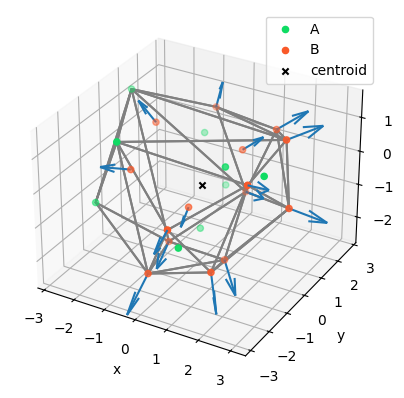

# core_functions


<!-- WARNING: THIS FILE WAS AUTOGENERATED! DO NOT EDIT! -->

#### 1. Load input data

------------------------------------------------------------------------

<a
href="https://github.com/valentina-lacivita/pointcloud/blob/main/point_cloud/core.py#L21"
target="_blank" style="float:right; font-size:smaller">source</a>

### load_input_data

>  load_input_data (path:str)

*Load data from a txt file with headers \[label, x, y, z\] and values
separated by spaces.*

<table>
<thead>
<tr>
<th></th>
<th><strong>Type</strong></th>
<th><strong>Details</strong></th>
</tr>
</thead>
<tbody>
<tr>
<td>path</td>
<td>str</td>
<td>path to data file</td>
</tr>
<tr>
<td><strong>Returns</strong></td>
<td><strong>DataFrame</strong></td>
<td></td>
</tr>
</tbody>
</table>

``` python
input_data = load_input_data("../data/cdd.txt")
```

``` python
input_data.head().round(2)
```

<div>
<style scoped>
    .dataframe tbody tr th:only-of-type {
        vertical-align: middle;
    }
&#10;    .dataframe tbody tr th {
        vertical-align: top;
    }
&#10;    .dataframe thead th {
        text-align: right;
    }
</style>

<table class="dataframe" data-quarto-postprocess="true" data-border="1">
<thead>
<tr style="text-align: right;">
<th data-quarto-table-cell-role="th"></th>
<th data-quarto-table-cell-role="th">label</th>
<th data-quarto-table-cell-role="th">x</th>
<th data-quarto-table-cell-role="th">y</th>
<th data-quarto-table-cell-role="th">z</th>
</tr>
</thead>
<tbody>
<tr>
<td data-quarto-table-cell-role="th">0</td>
<td>A</td>
<td>2.36</td>
<td>-0.45</td>
<td>0.65</td>
</tr>
<tr>
<td data-quarto-table-cell-role="th">1</td>
<td>A</td>
<td>0.97</td>
<td>-0.12</td>
<td>0.40</td>
</tr>
<tr>
<td data-quarto-table-cell-role="th">2</td>
<td>B</td>
<td>0.70</td>
<td>1.29</td>
<td>0.19</td>
</tr>
<tr>
<td data-quarto-table-cell-role="th">3</td>
<td>A</td>
<td>0.04</td>
<td>1.50</td>
<td>-1.14</td>
</tr>
<tr>
<td data-quarto-table-cell-role="th">4</td>
<td>A</td>
<td>0.01</td>
<td>0.14</td>
<td>-1.81</td>
</tr>
</tbody>
</table>

</div>

``` python
input_data.info()
```

    <class 'pandas.core.frame.DataFrame'>
    RangeIndex: 24 entries, 0 to 23
    Data columns (total 4 columns):
     #   Column  Non-Null Count  Dtype  
    ---  ------  --------------  -----  
     0   label   24 non-null     object 
     1   x       24 non-null     float64
     2   y       24 non-null     float64
     3   z       24 non-null     float64
    dtypes: float64(3), object(1)
    memory usage: 896.0+ bytes

The input contains a list of 24 points, each of which is defined by a
`label` and its *xyz*-coordinates.

``` python
input_data["label"].value_counts()
```

    label
    B    15
    A     9
    Name: count, dtype: int64

There are 2 different subsets of points: 9 *A* points and 15 *B* points.

#### 2. Calculate the centroid of the point cloud

------------------------------------------------------------------------

<a
href="https://github.com/valentina-lacivita/pointcloud/blob/main/point_cloud/core.py#L30"
target="_blank" style="float:right; font-size:smaller">source</a>

### get_centroid

>  get_centroid (points:<built-infunctionarray>)

*Calculate centroid of point cloud.*

<table>
<thead>
<tr>
<th></th>
<th><strong>Type</strong></th>
<th><strong>Details</strong></th>
</tr>
</thead>
<tbody>
<tr>
<td>points</td>
<td>array</td>
<td>xyz-coords of points</td>
</tr>
<tr>
<td><strong>Returns</strong></td>
<td><strong>array</strong></td>
<td></td>
</tr>
</tbody>
</table>

``` python
centroid = get_centroid(input_data[["x", "y", "z"]].values)
centroid.round(2)
```

    array([ 0.24, -0.16, -0.31])

#### 3. Generate new *C* points from *B* points

First create a function to select the *B* points:

------------------------------------------------------------------------

<a
href="https://github.com/valentina-lacivita/pointcloud/blob/main/point_cloud/core.py#L40"
target="_blank" style="float:right; font-size:smaller">source</a>

### get_labeled_points

>  get_labeled_points (input_data:pandas.core.frame.DataFrame, label:str)

*Select subset of points by label.*

<table>
<thead>
<tr>
<th></th>
<th><strong>Type</strong></th>
<th><strong>Details</strong></th>
</tr>
</thead>
<tbody>
<tr>
<td>input_data</td>
<td>DataFrame</td>
<td>points labels and xyz-coords</td>
</tr>
<tr>
<td>label</td>
<td>str</td>
<td>label of subset of points</td>
</tr>
<tr>
<td><strong>Returns</strong></td>
<td><strong>array</strong></td>
<td></td>
</tr>
</tbody>
</table>

``` python
B_points = get_labeled_points(input_data, "B")
```

``` python
B_points.shape
```

    (15, 3)

``` python
B_points[:3].round(2)
```

    array([[ 0.7 ,  1.29,  0.19],
           [ 0.23, -0.84, -0.63],
           [-1.49, -1.08,  0.14]])

Then, define a function that calculate a new point *C* at a given
distance from a point *B* along the direction centroid-\>*B*

------------------------------------------------------------------------

<a
href="https://github.com/valentina-lacivita/pointcloud/blob/main/point_cloud/core.py#L50"
target="_blank" style="float:right; font-size:smaller">source</a>

### calculate_C_point

>  calculate_C_point (B_point:<built-infunctionarray>, centroid:<built-
>                         infunctionarray>, distance:float=1.0)

*Given a point B, calculate a vector C originating from B and directed
outwards from the point cloud, along the direction
`centroid`–\>`B_point`.*

<table>
<thead>
<tr>
<th></th>
<th><strong>Type</strong></th>
<th><strong>Default</strong></th>
<th><strong>Details</strong></th>
</tr>
</thead>
<tbody>
<tr>
<td>B_point</td>
<td>array</td>
<td></td>
<td>B point</td>
</tr>
<tr>
<td>centroid</td>
<td>array</td>
<td></td>
<td>centroid of point cloud</td>
</tr>
<tr>
<td>distance</td>
<td>float</td>
<td>1.0</td>
<td>prescribed distance D of the B-&gt;C vector</td>
</tr>
<tr>
<td><strong>Returns</strong></td>
<td><strong>array</strong></td>
<td></td>
<td></td>
</tr>
</tbody>
</table>

For each *B* point calculate the corresponding *C* point

``` python
C_points = np.apply_along_axis(lambda p: calculate_C_point(p, centroid), 1, B_points)
```

``` python
C_points[:3].round(2)
```

    array([[ 0.99,  2.2 ,  0.5 ],
           [ 0.21, -1.74, -1.06],
           [-2.35, -1.54,  0.36]])

#### 4. Visualize the result

It is useful to visualize the results in 3D, together with the point
cloud. First let’s calculate the convex hull of the original point cloud
and plot it

------------------------------------------------------------------------

<a
href="https://github.com/valentina-lacivita/pointcloud/blob/main/point_cloud/core.py#L62"
target="_blank" style="float:right; font-size:smaller">source</a>

### plot_convex_hull

>  plot_convex_hull (ax:mpl_toolkits.mplot3d.axes3d.Axes3D, points:<built-
>                        infunctionarray>)

*3D plot of convex hull.*

<table>
<thead>
<tr>
<th></th>
<th><strong>Type</strong></th>
<th><strong>Details</strong></th>
</tr>
</thead>
<tbody>
<tr>
<td>ax</td>
<td>Axes3D</td>
<td></td>
</tr>
<tr>
<td>points</td>
<td>array</td>
<td>xyz-coords of points</td>
</tr>
<tr>
<td><strong>Returns</strong></td>
<td><strong>Axes3D</strong></td>
<td></td>
</tr>
</tbody>
</table>

Now let’s define the functions to plot the point cloud and the new
vectors *C*

------------------------------------------------------------------------

<a
href="https://github.com/valentina-lacivita/pointcloud/blob/main/point_cloud/core.py#L75"
target="_blank" style="float:right; font-size:smaller">source</a>

### plot_points

>  plot_points (ax:mpl_toolkits.mplot3d.axes3d.Axes3D,
>                   input_data:pandas.core.frame.DataFrame)

*3D plot of original points.*

<table>
<thead>
<tr>
<th></th>
<th><strong>Type</strong></th>
<th><strong>Details</strong></th>
</tr>
</thead>
<tbody>
<tr>
<td>ax</td>
<td>Axes3D</td>
<td></td>
</tr>
<tr>
<td>input_data</td>
<td>DataFrame</td>
<td>labels and xyz-coords of points</td>
</tr>
<tr>
<td><strong>Returns</strong></td>
<td><strong>Axes3D</strong></td>
<td></td>
</tr>
</tbody>
</table>

------------------------------------------------------------------------

<a
href="https://github.com/valentina-lacivita/pointcloud/blob/main/point_cloud/core.py#L87"
target="_blank" style="float:right; font-size:smaller">source</a>

### plot_vectors

>  plot_vectors (ax, vectors:<built-infunctionarray>, origins:<built-
>                    infunctionarray>, length:float=0.3)

*Plot vectors as arrows.*

<table>
<thead>
<tr>
<th></th>
<th><strong>Type</strong></th>
<th><strong>Default</strong></th>
<th><strong>Details</strong></th>
</tr>
</thead>
<tbody>
<tr>
<td>ax</td>
<td></td>
<td></td>
<td></td>
</tr>
<tr>
<td>vectors</td>
<td>array</td>
<td></td>
<td>vector to plot</td>
</tr>
<tr>
<td>origins</td>
<td>array</td>
<td></td>
<td>origin of vector</td>
</tr>
<tr>
<td>length</td>
<td>float</td>
<td>0.3</td>
<td>vector length</td>
</tr>
</tbody>
</table>

------------------------------------------------------------------------

<a
href="https://github.com/valentina-lacivita/pointcloud/blob/main/point_cloud/core.py#L103"
target="_blank" style="float:right; font-size:smaller">source</a>

### plot_ABC

>  plot_ABC (input_data:pandas.core.frame.DataFrame, C_points:<built-
>                infunctionarray>, centroid:<built-infunctionarray>)

*Plot point cloud including its convex hull and the C vectors as
arrows.*

<table>
<thead>
<tr>
<th></th>
<th><strong>Type</strong></th>
<th><strong>Details</strong></th>
</tr>
</thead>
<tbody>
<tr>
<td>input_data</td>
<td>DataFrame</td>
<td>labels and xyz-coords of points</td>
</tr>
<tr>
<td>C_points</td>
<td>array</td>
<td>calculated C points</td>
</tr>
<tr>
<td>centroid</td>
<td>array</td>
<td>centroid of point cloud</td>
</tr>
<tr>
<td><strong>Returns</strong></td>
<td><strong>figure</strong></td>
<td></td>
</tr>
</tbody>
</table>

``` python
fig = plot_ABC(input_data, C_points, centroid)
```


Let’s create a function to run it all, end-to-end:

------------------------------------------------------------------------

<a
href="https://github.com/valentina-lacivita/pointcloud/blob/main/point_cloud/core.py#L128"
target="_blank" style="float:right; font-size:smaller">source</a>

### calculate_C_points

>  calculate_C_points (input_file:str, output_file:str,
>                          output_plot_file:str=None, distance:float=1.0)

*Calculate C points and export them to a file (together with the result
plot, optionally).*

<table>
<colgroup>
<col style="width: 6%" />
<col style="width: 25%" />
<col style="width: 34%" />
<col style="width: 34%" />
</colgroup>
<thead>
<tr>
<th></th>
<th><strong>Type</strong></th>
<th><strong>Default</strong></th>
<th><strong>Details</strong></th>
</tr>
</thead>
<tbody>
<tr>
<td>input_file</td>
<td>str</td>
<td></td>
<td>input file path with point A and B data</td>
</tr>
<tr>
<td>output_file</td>
<td>str</td>
<td></td>
<td>output file path for the generated C points</td>
</tr>
<tr>
<td>output_plot_file</td>
<td>str</td>
<td>None</td>
<td>output file path for the plot of point cloud and C vectors</td>
</tr>
<tr>
<td>distance</td>
<td>float</td>
<td>1.0</td>
<td>prescribed distance D of the B-&gt;C vectors</td>
</tr>
</tbody>
</table>

And run it on the input data:

``` python
input_data = "../data/cdd.txt"
output_result = "../data/result_C_points.txt"
output_plot = "../data/result_plot.png"
```

``` python
calculate_C_points(input_data, output_result, output_plot_file=output_plot)
```

    Loading input data from '../data/cdd.txt'...
    Calculate points...
    Saving result data to '../data/result_C_points.txt'...
    Exporting plots to '../data/result_plot.png'...
    Done.


